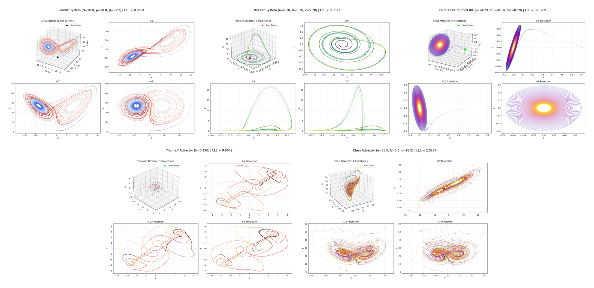

# Dynamic System Simulator & Visualizer

  
   
  <em>A showcase of various chaotic attractors simulated by this project.</em>

## Overview

Welcome to the Dynamic System Simulator repository! This project provides Python tools to simulate, analyze, and visualize the fascinating behavior of several classic **chaotic dynamical systems**. Explore the intricate beauty of strange attractors and the fundamental concepts of chaos theory right from your command line or through an interactive interface.

The repository includes simulators for:

* **Lorenz Attractor:** The iconic "butterfly effect" system derived from atmospheric modeling.
* **Rössler Attractor:** A system designed for minimal chaotic dynamics, featuring a distinct "folded-band" structure.
* **Chua's Circuit:** A simple electronic circuit famous for its "double-scroll" attractor, demonstrating chaos in a physical system.
* **Thomas' Attractor:** Exhibits cyclic symmetry and produces intricate, looping ("pretzel-like") structures.
* **Chen Attractor:** A relative of the Lorenz system with its own unique chaotic properties.

You can interact with these systems through:

1.  **Individual Scripts:** Standalone Python scripts dedicated to each attractor, perfect for focused study.
2.  **Unified Framework:** A powerful script (`chaos-framework/chaos_fw.py`) that combines all systems, offering both a guided interactive setup and a flexible command-line interface (CLI) for running simulations with custom parameters.

## Features

* **Multiple Attractor Simulation:** Explore 5+ well-known chaotic systems.
* **Largest Lyapunov Exponent (LLE) Analysis:** Quantify the level of chaos in each simulation with LLE estimation and interpretation (saved to `.txt`).
* **Static Visualizations:** Generate multi-panel plots (PNG) showing the 3D attractor structure and its 2D projections using Matplotlib.
* **Dynamic Animations:** Create MP4 video animations of the trajectory evolving over time (requires FFmpeg).
* **Interactive 3D Plots:** Generate standalone HTML files using Plotly for in-depth, interactive exploration (rotate, zoom, pan) of the attractor geometry in your browser.
* **Dual-Mode Framework:** Use the unified framework via an easy-to-use interactive prompt or a powerful command-line interface.
* **Cross-Platform Output Opening:** Attempts to automatically open the generated interactive HTML file on both desktop systems and Termux.
* **Customizable:** Easily modify parameters, initial conditions, simulation time, and output settings in both individual scripts and the framework.

## Project Structure

