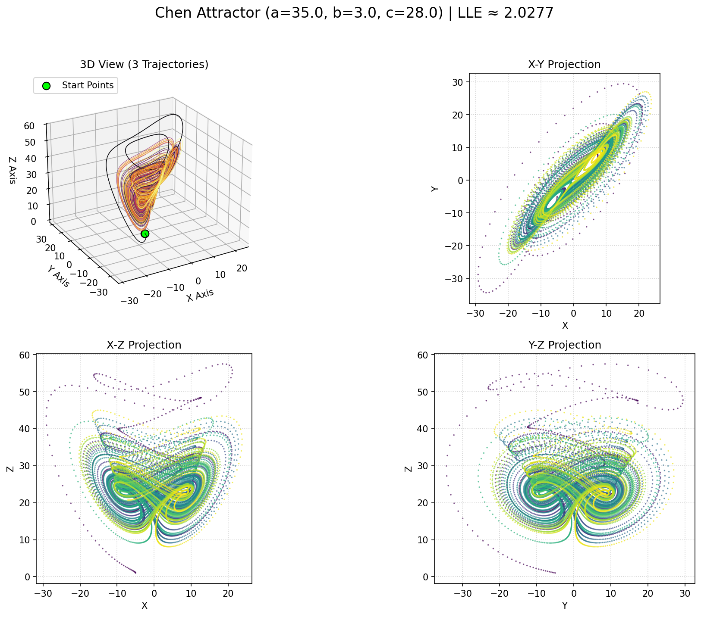

# Exploring the Chen Attractor: Simulation & Visualization

<a href="chen_output/chen_interactive.html" title="Click to view Interactive Chen Attractor Plot">
  
</a>

>(Click the image above to explore the interactive 3D version if available)*

## 1. Introduction: A Chaotic Relative of Lorenz

Welcome to the fascinating world of the **Chen attractor**! Discovered by Guanrong Chen and Tetsushi Ueta in 1999, this dynamical system is a captivating example of **deterministic chaos**. While structurally similar to the famous Lorenz system, the Chen system exhibits distinct and complex chaotic behavior under specific parameter sets. It serves as another canonical example demonstrating how simple sets of differential equations can generate intricate, unpredictable, yet bounded trajectories.

This repository contains a Python script `chen_simulator.py` designed to bring the Chen attractor to life. It allows you to:

* **Simulate:** Numerically integrate the Chen system's differential equations over time.
* **Analyze:** Estimate the Largest Lyapunov Exponent (LLE) to quantify the system's chaotic nature.
* **Visualize:** Generate static 3D plots, 2D projections, video animations, and fully interactive 3D HTML plots.

Think of this README as your guide not just to running the script, but to understanding the beautiful complexity hidden within these equations.

## 2. The Mathematics: Defining the Chen System

The Chen attractor is described by a system of three coupled, non-linear ordinary differential equations (ODEs):

$$
\begin{aligned}
\frac{dx}{dt} &= a (y - x) \\
\frac{dy}{dt} &= (c - a) x - x z + c y \\
\frac{dz}{dt} &= x y - b z
\end{aligned}
$$

Where:

* $x, y, z$ are the state variables of the system, representing coordinates in a 3D phase space.
* $t$ represents time.
* $a, b, c$ are the system parameters that dictate its behavior.

**Parameters and Their Roles (Simplified):**

* **`a` (often denoted $\alpha$)**: Influences the coupling between the $x$ and $y$ variables and the rate of change of $x$.
* **`b` (often denoted $\beta$)**: Represents a damping or dissipation factor primarily affecting the $z$ variable.
* **`c` (often denoted $\gamma$)**: Affects the dynamics of the $y$ variable, contributing to the system's instability and stretching.

The canonical parameter values often used to exhibit clear chaotic behavior are:
* $a = 35$
* $b = 3$
* $c = 28$

Slight changes in these parameters can drastically alter the system's dynamics, leading to stable points, periodic orbits, or different chaotic regimes.

## 3. The Nature of Chaos

The Chen system, like Lorenz, exhibits key characteristics of chaos:

* **Sensitivity to Initial Conditions (The Butterfly Effect):** Tiny differences in the starting values of $x, y, z$ lead to exponentially diverging trajectories over time. Two simulations started very close together will quickly become completely different, making long-term prediction impossible.
* **Strange Attractor:** Despite being unpredictable locally, the system's trajectory remains confined to a specific, bounded region in phase space. This region, with its intricate, often fractal structure, is known as a "strange attractor." The trajectory will explore this attractor indefinitely without ever repeating the exact same path or settling into a simple fixed point or loop.
* **Positive Lyapunov Exponent:** The Largest Lyapunov Exponent (LLE) measures the average exponential rate of divergence of nearby trajectories. A positive LLE is a strong mathematical indicator of chaos. This script calculates an estimate of the LLE.

Visually, the Chen attractor often appears somewhat similar to the Lorenz attractor but can exhibit different symmetries and shapes depending on the parameters.

## 4. Script Features & Functionality

This Python script provides a comprehensive toolkit for exploring the Chen system:

1.  **ODE Integration:** Uses `scipy.integrate.odeint` to numerically solve the system of differential equations, generating the trajectory data $(x(t), y(t), z(t))$.
2.  **LLE Calculation:** Implements the standard algorithm for estimating the LLE by tracking the divergence rate of two initially close trajectories over a long integration time.
3.  **Static Plot Generation:** Creates a multi-panel PNG image using Matplotlib:
    * A **3D plot** showing the attractor's overall structure, color-coded by time. Includes starting points for reference.
    * **2D projections** (X-Y, X-Z, Y-Z) to view the attractor from different perspectives.
4.  **Animation Video:** Generates an MP4 video (requires **FFmpeg**) using Matplotlib's animation tools, showing the trajectory evolving dynamically over time with a fading tail.
5.  **Interactive HTML Plot:** Creates a standalone HTML file using Plotly, embedding an interactive 3D plot. This allows you to rotate, zoom, pan, and inspect the attractor's structure directly in your web browser.
6.  **Cross-Platform File Opening:** Attempts to automatically open the generated HTML file using your system's default browser (leveraging `webbrowser` module and checking for `termux-open` on Termux systems).

## 5. How to Use the Script

**Dependencies:**

* Python 3.x
* NumPy (`pip install numpy`)
* SciPy (`pip install scipy`)
* Matplotlib (`pip install matplotlib`)
* Plotly (`pip install plotly`)
* **FFmpeg:** (Required for MP4 animation) - Must be installed separately via your system's package manager (e.g., `sudo apt install ffmpeg`, `brew install ffmpeg`, `pkg install ffmpeg` on Termux).

**Running the Script:**

1.  Save the script (e.g., as `chen_simulator.py`).
2.  Open your terminal or command prompt.
3.  Navigate to the directory where you saved the script.
4.  Run the script using:
    ```bash
    python chen_simulator.py
    ```

**Outputs:**

The script will create an output directory (default: `chen_output`) containing:

* `chen_lle_results.txt`: Text file with system parameters and the calculated LLE estimate and interpretation.
* `chen_static_plots.png`: Multi-panel image showing the 3D attractor and 2D projections.
* `chen_animation.mp4`: Animation video of the trajectory.
* `chen_interactive.html`: Interactive 3D plot (this is the file the script attempts to open).

## 6. Configuration & Customization

You can easily tweak the simulation and visualization by modifying the constants defined near the top of the script:

* **Output Files:** Change `OUTPUT_DIR_NAME`, `VIDEO_ANIMATION_FILENAME`, etc., to customize output locations and names.
* **Chen Parameters:**
    * `CHEN_PARAM_A`, `CHEN_PARAM_B`, `CHEN_PARAM_C`: Modify these (`a`, `b`, `c`) to explore different system behaviors. Try values slightly different from the defaults (35, 3, 28) and observe the changes!
* **Initial Conditions:**
    * `INITIAL_STATES`: Change the starting `[x, y, z]` values. Explore how sensitive the final attractor shape is (or isn't) to different starting points *within* the basin of attraction. The script uses slightly perturbed states for visualization clarity.
* **Time & Steps:**
    * `VIS_T_END`, `VIS_NUM_STEPS`: Control the duration and resolution for plots/animations. Longer time (`T_END`) reveals more of the attractor; more steps (`NUM_STEPS`) provide finer detail but increase computation time.
    * `LLE_T_END`, `LLE_NUM_STEPS`: Control duration and resolution for LLE calculation. LLE generally requires *longer* integration times than visualization for accurate estimation.
* **LLE Settings:**
    * `LLE_EPSILON`: The initial tiny separation between trajectories for LLE calculation. Usually doesn't need changing.
* **Animation Settings:**
    * `ANIMATION_WRITER`: Set to your preferred animation library (e.g., `ffmpeg`). Ensure it's installed.
    * `ANIMATION_FPS`, `ANIMATION_DPI`, `FRAME_STEP`, `TAIL_LENGTH`, `ANIMATION_INTERVAL`: Tune the animation's speed, quality, and appearance. `FRAME_STEP` controls how many simulation points are skipped per frame (higher = faster animation). `TAIL_LENGTH` defines the length of the trailing line in *points*.
* **Plotting:**
    * `STATIC_PLOT_DPI`: Adjust the resolution (dots per inch) of the saved static PNG plot.

## 7. Understanding the Outputs

* **LLE Results (`.txt`):** The key takeaway is the estimated LLE value.
    * **Positive LLE (> ~0.01):** Strong indicator of chaos.
    * **Negative LLE (< ~-0.01):** System likely converges to a stable point or limit cycle.
    * **LLE near Zero:** Suggests potentially periodic or quasi-periodic behavior. Requires careful interpretation.
* **Static Plots (`.png`):** Observe the classic structure. The 3D plot shows the trajectory colored by time (e.g., yellow/red for later times), revealing how the attractor is traced. The 2D projections help disentangle the 3D structure.
* **Animation (`.mp4`):** Watch the system evolve! See how the trajectory moves between different regions of the attractor space.
* **Interactive Plot (`.html`):** This is often the most insightful! **Open this file in your web browser.** Use your mouse to rotate, zoom, and pan. Explore the attractor's intricate folds and layers from any angle.

## 8. Further Exploration

* **Parameter Space:** Systematically vary parameters `a`, `b`, or `c` around the default values. Can you find regions where the behavior becomes periodic or collapses to a point? Search online for "Chen attractor parameter space" for known bifurcations.
* **Integration Time:** Run the visualization for much longer (`VIS_T_END = 200` or more) with more steps to see if the attractor becomes denser or reveals finer structures.
* **Initial Conditions:** Try starting points far from the default values. Does the system still converge to the same attractor, or does it diverge or find a different behavior? (This relates to the concept of basins of attraction).
* **Code Modification:** Adapt the script to plot Poincare sections or calculate the full Lyapunov spectrum for deeper analysis.

---

