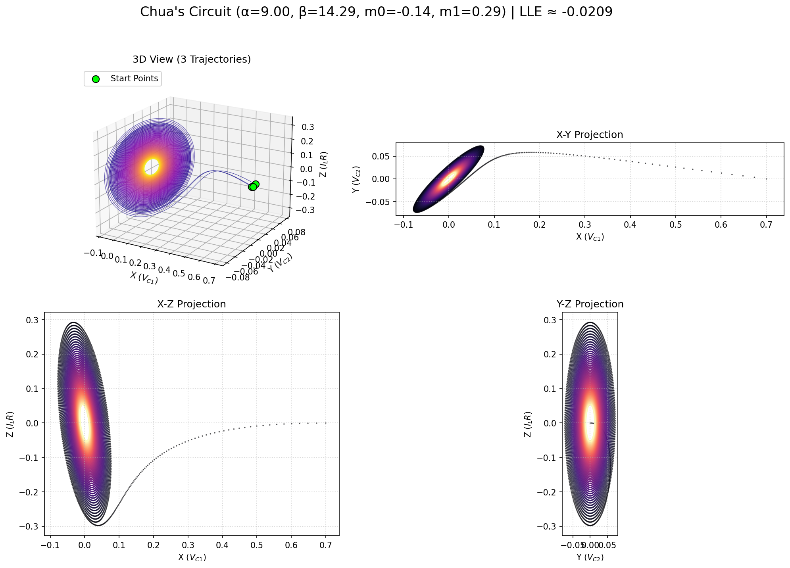

# Exploring Chua's Circuit: Chaos in Electronics

<a href="chua_output/chua_interactive.html" title="Click to view Interactive Chua's Circuit Plot">
  
</a>

> (Click the image above to explore the interactive 3D version if available)*

## 1. Introduction: The First Chaotic Circuit

Welcome to the realm of **Chua's circuit**, a landmark in the study of chaos theory. Designed by Leon O. Chua in 1983 and first experimentally realized shortly after, it holds the distinction of being one of the simplest electronic circuits that demonstrably exhibits chaotic behavior. Its confirmation provided tangible proof that chaos wasn't just a mathematical abstraction but a real-world phenomenon observable in simple physical systems.

The circuit's dynamics often manifest as the iconic **"double-scroll" attractor**, one of the most famous visual representations of chaos.

This repository provides a Python script `chua.py` that allows you to simulate, analyze, and visualize the behavior of Chua's circuit, exploring its journey into chaos from the comfort of your machine.

## 2. The Mathematics: Modeling the Circuit

Chua's circuit dynamics are captured by a system of three non-linear ordinary differential equations (ODEs). These equations typically model the voltages across two capacitors ($x = V_{C1}$, $y = V_{C2}$) and the current through an inductor ($z = I_L$, often scaled by a resistance R for dimensionless form).

The system is defined as:

$$
\begin{aligned}
\frac{dx}{dt} &= \alpha (y - x - f(x)) \\
\frac{dy}{dt} &= x - y + z \\
\frac{dz}{dt} &= -\beta y
\end{aligned}
$$

The crucial non-linearity comes from $f(x)$, representing the voltage-current characteristic of the non-linear resistor, often called **Chua's Diode**. It's typically modeled as a three-segment piecewise-linear function:

$$
f(x) =
\begin{cases}
m_0 x & \text{if } |x| \le E \\
m_1 x + (m_0 - m_1) E & \text{if } x > E \\
m_1 x - (m_0 - m_1) E & \text{if } x < -E
\end{cases}
$$

Where:

* $x, y, z$ are the state variables (representing voltages and current).
* $t$ is time.
* $\alpha, \beta$ are parameters determined by the circuit's linear resistors, capacitors, and inductor values (e.g., $\alpha = C_2/C_1$, $\beta = C_2 R^2 / L$ in some formulations).
* $m_0, m_1$ are the slopes of the inner and outer segments of the piecewise-linear function $f(x)$, determined by the operational amplifiers and resistors making up the Chua diode. $m_0$ is typically negative, while $m_1$ is positive.
* $E$ represents the breakpoint voltage(s) where the slope of $f(x)$ changes (often normalized to $E=1$).

**Typical Parameters for Double-Scroll Chaos:**

A widely studied set of parameters that yields the double-scroll attractor is:
* $\alpha \approx 9.0 \text{ to } 10.0$
* $\beta \approx 14.28 \text{ (often } 100/7 \text{)}$
* $m_0 \approx -1/7$
* $m_1 \approx 2/7$
* $E = 1$ (by normalization)

Varying these parameters, especially $\alpha$ and $\beta$, can lead the circuit through various bifurcations, resulting in different attractors (including periodic orbits, single scrolls, and other chaotic forms).

## 3. The Double-Scroll: Chaos Manifested

Chua's circuit beautifully demonstrates the core principles of chaos:

* **Deterministic but Unpredictable:** The equations are perfectly deterministic, yet the long-term behavior is unpredictable due to extreme sensitivity to initial conditions.
* **The Double-Scroll Attractor:** For the standard parameters, the system trajectory wanders complexly around two distinct regions (the "scrolls"), corresponding to different operating points of the Chua diode, before jumping unpredictably between them. This bounded, intricate structure is the strange attractor.
* **Physical Realizability:** Its simplicity allowed for physical construction and experimental verification of chaos, bridging the gap between theoretical models and tangible reality.
* **Positive Lyapunov Exponent:** Like other chaotic systems, the double-scroll regime is characterized by a positive Largest Lyapunov Exponent (LLE), indicating the exponential divergence of nearby trajectories.

## 4. Script Features & Functionality

This Python script empowers exploration of Chua's circuit through:

1.  **ODE Integration:** Solves the Chua system using `scipy.integrate.odeint`.
2.  **LLE Calculation:** Estimates the LLE to confirm and quantify the chaotic nature.
3.  **Static Plot Generation:** Uses Matplotlib to create a PNG image displaying:
    * The 3D double-scroll attractor (time-colored).
    * Standard 2D projections (X-Y, X-Z, Y-Z).
4.  **Animation Video:** Generates an MP4 video (requires **FFmpeg**) showing the trajectory dynamically tracing the double-scroll attractor.
5.  **Interactive HTML Plot:** Creates a Plotly-based interactive 3D plot in an HTML file, perfect for detailed exploration of the attractor's structure in a browser.
6.  **Cross-Platform File Opening:** Attempts to automatically open the generated HTML file.

## 5. How to Use the Script

**Dependencies:**

* Python 3.x
* NumPy (`pip install numpy`)
* SciPy (`pip install scipy`)
* Matplotlib (`pip install matplotlib`)
* Plotly (`pip install plotly`)
* **FFmpeg:** (Required for MP4 animation) - Install via system package manager.

**Running the Script:**

1.  Save the script (e.g., `chua_simulator.py`).
2.  Navigate to its directory in your terminal.
3.  Execute:
    ```bash
    python chua_simulator.py
    ```

**Outputs:**

Look for results in the `chua_output` directory:

* `chua_lle_results.txt`: LLE estimate, parameters, and interpretation.
* `chua_static_plots.png`: Static 3D and 2D plots.
* `chua_animation.mp4`: Dynamic video simulation.
* `chua_interactive.html`: Interactive 3D plot (auto-opens if possible).

## 6. Configuration & Customization

Modify the constants near the beginning of the script to experiment:

* **Output Files:** Change `OUTPUT_DIR_NAME`, etc.
* **Chua Parameters:**
    * `CHUA_PARAM_ALPHA`, `CHUA_PARAM_BETA`, `CHUA_PARAM_M0`, `CHUA_PARAM_M1`, `CHUA_PARAM_E`: Adjust these ($\alpha, \beta, m_0, m_1, E$) to explore different behaviors. Searching for "Chua circuit bifurcation diagram" can provide maps of behavior for different $\alpha$ and $\beta$.
* **Initial Conditions:**
    * `INITIAL_STATES`: Change the starting `[x, y, z]` or `[V_C1, V_C2, I_L*R]` values. Does the system always end up on the double-scroll from different points?
* **Time & Steps:**
    * `VIS_T_END`, `VIS_NUM_STEPS`, `LLE_T_END`, `LLE_NUM_STEPS`: Control simulation duration and detail.
* **LLE Settings:** `LLE_EPSILON`.
* **Animation Settings:** `ANIMATION_WRITER`, `FPS`, `DPI`, `FRAME_STEP`, `TAIL_LENGTH`, `INTERVAL`.
* **Plotting:** `STATIC_PLOT_DPI`.

## 7. Understanding the Outputs

* **LLE Results (`.txt`):** A positive LLE confirms the chaotic nature of the double-scroll.
* **Static Plots (`.png`):** Clearly visualizes the characteristic two-lobed structure. The 2D projections can reveal interesting symmetries or patterns.
* **Animation (`.mp4`):** Helps understand the flow – how the trajectory orbits one scroll before unpredictably jumping to the other.
* **Interactive Plot (`.html`):** Essential for appreciating the 3D structure. Rotate it to see how the "sheets" of the attractor fold and merge.

## 8. Further Exploration

* **Parameter Sweeps:** Systematically vary $\alpha$ or $\beta$ while keeping others constant. Can you observe the transition from simple orbits to the double-scroll?
* **Diode Variations:** Modify $m_0$ and $m_1$. How do the slopes of the Chua diode affect the attractor's shape and existence?
* **Different Attractors:** Research other parameter sets for Chua's circuit that produce different chaotic attractors (like the single-scroll Rössler-like attractor) or periodic windows.
* **Real Circuit:** If you're into electronics, research how to build a physical Chua's circuit! It's a classic electronics project.

---
