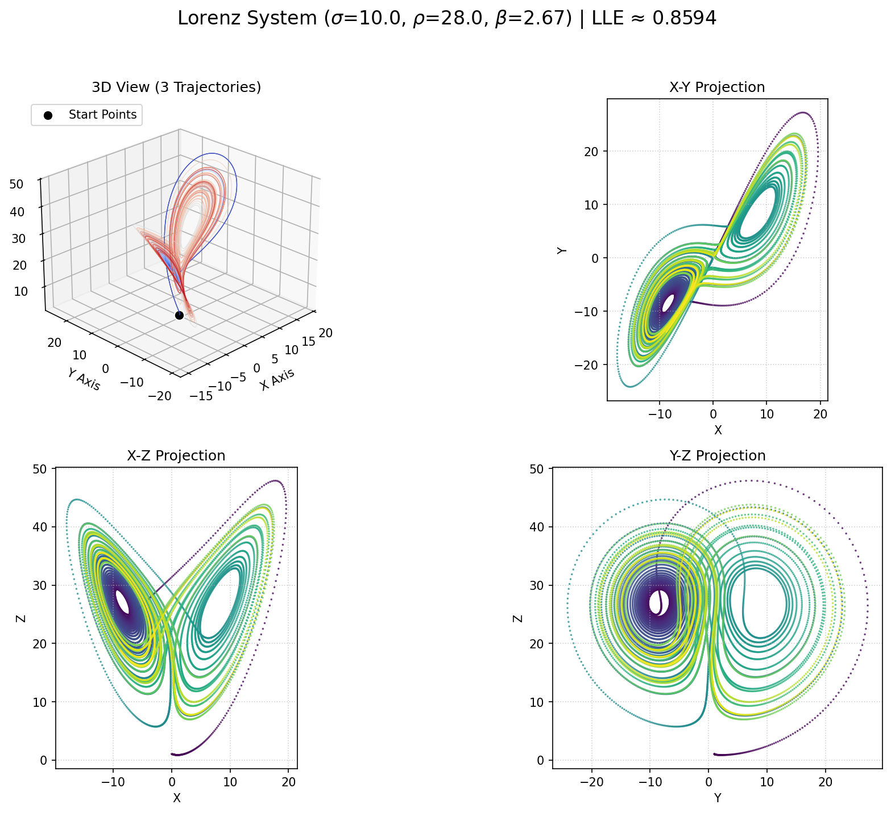

# Exploring the Lorenz Attractor: The Butterfly Effect Visualized

<a href="lorenz_output/lorenz_interactive.html" title="Click to view Interactive Lorenz Attractor Plot">
  
</a>

> (Click the image above to explore the interactive 3D version if available)*

## 1. Introduction: Where Chaos Took Flight

Step into the system that arguably launched the field of chaos theory: the **Lorenz attractor**. Developed by meteorologist Edward Lorenz in 1963 while modeling atmospheric convection, this system of three simple differential equations unexpectedly revealed a universe of complex, unpredictable behavior hidden within deterministic laws.

Lorenz's work led to the popular concept of the **"Butterfly Effect,"** illustrating how tiny changes in initial conditions could lead to vastly different outcomes – the metaphorical flap of a butterfly's wings potentially altering the path of a distant tornado. The system's visual representation is the famous and elegant "butterfly" strange attractor.

This repository contains a Python script (`lorenz.py`) designed to simulate, analyze, and visualize the Lorenz system, allowing you to witness the birth of chaos theory firsthand.

## 2. The Mathematics: Modeling Atmospheric Convection (Simplified)

The Lorenz system simplifies the equations governing fluid dynamics in atmospheric convection. It describes the evolution of three state variables:

* $x$: Proportional to the intensity of the convective motion.
* $y$: Proportional to the temperature difference between ascending and descending currents.
* $z$: Proportional to the deviation of the vertical temperature profile from linearity.

The governing equations are:

$$
\begin{aligned}
\frac{dx}{dt} &= \sigma (y - x) \\
\frac{dy}{dt} &= x (\rho - z) - y \\
\frac{dz}{dt} &= x y - \beta z
\end{aligned}
$$

Where:

* $\sigma$ (sigma): The **Prandtl number**, relating fluid viscosity to thermal conductivity.
* $\rho$ (rho): The **Rayleigh number**, proportional to the temperature difference driving the convection. This is the primary control parameter for observing bifurcations.
* $\beta$ (beta): A geometric factor related to the aspect ratio of the convective cells.

**The Classic Chaotic Parameters:**

The most famous parameter set, widely studied and known to produce the distinct butterfly attractor, is:
* $\sigma = 10$
* $\rho = 28$
* $\beta = 8/3$

Changes in these parameters, especially $\rho$, can lead the system through different states, including stable fixed points, transient chaos, and fully developed chaos.

## 3. The Birth of Chaos: Sensitivity and Structure

Lorenz stumbled upon the system's chaotic nature serendipitously. Rerunning a simulation from rounded-off intermediate values, he found the new results diverged dramatically from the original run, revealing **extreme sensitivity to initial conditions**. This observation shattered the long-held deterministic view that small initial uncertainties would only lead to small eventual uncertainties.

Key aspects of the Lorenz system's chaos include:

* **The Butterfly Effect:** The tangible demonstration of sensitive dependence on initial conditions.
* **The Strange Attractor:** Trajectories are bounded but never repeat or settle down. They trace out the intricate, two-lobed butterfly shape, endlessly looping around one "wing" before unpredictably jumping to the other. The attractor has a fractal structure.
* **Deterministic Nature:** Despite the unpredictability, the system follows exact mathematical rules. The chaos arises from the non-linear interactions ($xz$ and $xy$ terms), which stretch and fold the phase space.
* **Positive Lyapunov Exponent:** A positive LLE confirms the exponential divergence of nearby trajectories, a hallmark of chaos.

## 4. Script Features & Functionality

This Python script provides the tools to explore Lorenz's discovery:

1.  **ODE Integration:** Uses `scipy.integrate.odeint` to solve the Lorenz equations numerically.
2.  **LLE Calculation:** Estimates the Largest Lyapunov Exponent to quantify the chaos for the given parameters.
3.  **Static Plot Generation:** Creates a Matplotlib PNG image featuring:
    * The iconic 3D butterfly attractor, colored by time progression.
    * 2D projections (X-Y, X-Z, Y-Z) revealing different facets of the structure.
4.  **Animation Video:** Generates an MP4 video (requires **FFmpeg**) animating the trajectory as it traces the butterfly wings.
5.  **Interactive HTML Plot:** Creates a Plotly-based interactive 3D plot, allowing you to rotate, zoom, and explore the attractor's geometry in detail within your browser.
6.  **Cross-Platform File Opening:** Attempts to automatically launch the generated HTML file.

## 5. How to Use the Script

**Dependencies:**

* Python 3.x
* NumPy (`pip install numpy`)
* SciPy (`pip install scipy`)
* Matplotlib (`pip install matplotlib`)
* Plotly (`pip install plotly`)
* **FFmpeg:** (Required for MP4 animation) - Install via system package manager.

**Running the Script:**

1.  Save the script (e.g., `lorenz_simulator.py`).
2.  Navigate to its directory in your terminal.
3.  Execute:
    ```bash
    python lorenz_simulator.py
    ```

**Outputs:**

Check the `lorenz_output` directory for:

* `lorenz_lle_results.txt`: Parameters, LLE estimate, and interpretation.
* `lorenz_static_plots.png`: Static 3D and 2D plots.
* `lorenz_animation.mp4`: Dynamic simulation video.
* `lorenz_interactive.html`: Interactive 3D plot (this is the file the script tries to open).

## 6. Configuration & Customization

Experiment by adjusting the constants near the script's start:

* **Output Files:** Change `OUTPUT_DIR_NAME`, etc.
* **Lorenz Parameters:**
    * `LORENZ_PARAM_SIGMA`, `LORENZ_PARAM_RHO`, `LORENZ_PARAM_BETA`: Modify $\sigma, \rho, \beta$. **Crucially, try varying $\rho$!** Below $\rho \approx 24.74$ (for $\sigma=10, \beta=8/3$), the system settles to stable fixed points. Above this value, chaos emerges. Explore values like $\rho=15$ (stable), $\rho=25$ (chaotic onset), $\rho=99.96$ (periodic window), $\rho=150$ (different chaotic structure).
* **Initial Conditions:**
    * `INITIAL_STATES`: Change the starting `[x, y, z]` values. Observe the "Butterfly Effect" by making tiny changes (e.g., change `y0` from 1.0 to 1.000001) and comparing simulation results (though LLE captures this mathematically).
* **Time & Steps:**
    * `VIS_T_END`, `VIS_NUM_STEPS`, `LLE_T_END`, `LLE_NUM_STEPS`: Control simulation length and detail. Lorenz dynamics are relatively fast, but longer times trace the attractor more fully.
* **LLE Settings:** `LLE_EPSILON`.
* **Animation Settings:** `ANIMATION_WRITER`, `FPS`, `DPI`, `FRAME_STEP`, `TAIL_LENGTH`, `INTERVAL`.
* **Plotting:** `STATIC_PLOT_DPI`.

## 7. Understanding the Outputs

* **LLE Results (`.txt`):** For $\rho=28$, expect a positive LLE (around 0.9). Observe how it changes as you vary $\rho$.
* **Static Plots (`.png`):** Identify the two "wings" or lobes of the attractor. Notice how the 2D projections differ significantly from simpler systems.
* **Animation (`.mp4`):** See the trajectory orbiting one lobe for a while before unpredictably switching to the other.
* **Interactive Plot (`.html`):** Explore the structure's "thickness" (related to its fractal dimension) and the near-misses of trajectories without ever intersecting.

## 8. Further Exploration

* **Bifurcation Diagram:** Systematically vary $\rho$ over a range (e.g., 0 to 50 or higher) and plot a characteristic variable (like local maxima of $z$) against $\rho$. This reveals the transitions from stable points to chaos.
* **Poincaré Sections:** Plot points where the trajectory intersects a specific plane (e.g., $z = \rho - 1$). This can reveal fractal structure within the attractor.
* **Sensitivity Visualization:** Run two simulations with *very* slightly different initial conditions and plot both trajectories simultaneously or plot the distance between them over time to directly visualize the exponential divergence.

---
