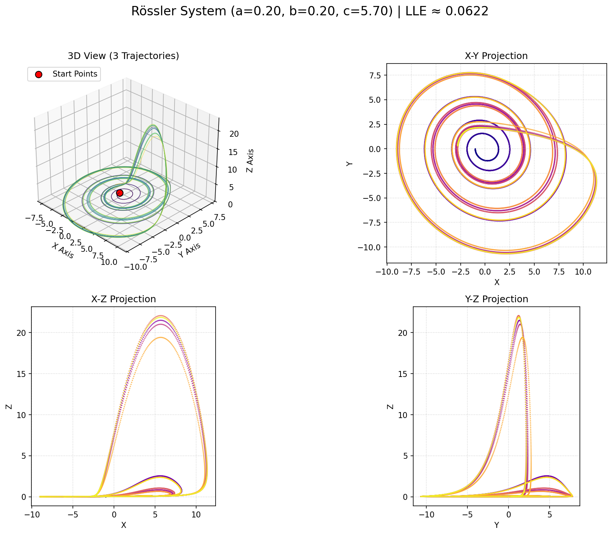

# Exploring the Rössler Attractor: Minimal Chaos

<a href="rossler_output/rossler_interactive.html" title="Click to view Interactive Rössler Attractor Plot">
  
</a>

> (Click the image above to explore the interactive 3D version if available)*

## 1. Introduction: Simplicity Yielding Complexity

Welcome to the world of the **Rössler attractor**, a prime example of how surprisingly simple mathematical systems can generate profoundly complex and chaotic behavior. Designed by German biochemist Otto Rössler in 1976, the system was intentionally constructed as a minimal abstract model exhibiting chaos, contrasting with the Lorenz system's direct (though simplified) physical origins.

The Rössler system is famous for its characteristic attractor shape – a distinct band that is continuously stretched, twisted, and folded back onto itself in three-dimensional space. It serves as a classic illustration of the "stretch-and-fold" mechanism fundamental to many chaotic systems.

This repository provides a Python script (`rossler.py`) that allows you to simulate the Rössler system, analyze its chaotic properties, and visualize its unique attractor through various plots and animations.

## 2. The Mathematics: A Minimal Chaotic System

The Rössler system is defined by a set of three coupled ordinary differential equations (ODEs), notable for having only one non-linear term (the $ xz $ term in the third equation):

$$
\begin{aligned}
\frac{dx}{dt} &= -y - z \\
\frac{dy}{dt} &= x + a y \\
\frac{dz}{dt} &= b + z (x - c)
\end{aligned}
$$

Where:

* $ x, y, z $ are the state variables defining a point in 3D phase space.
* $ t $ represents time.
* $ a, b, c $ are adjustable positive parameters that control the system's dynamics.

**Interpreting the Terms (Conceptual):**

* The first two equations ($ dx/dt = -y - z $ and $ dy/dt = x + a y $) tend to create rotational motion or an outward spiral in the $ x-y $ plane, influenced by parameter $ a $.
* The third equation ($ dz/dt = b + z(x-c) $) introduces the crucial non-linearity. The $ zx $ term causes the trajectory to be "lifted" or "pushed down" in the $ z $ direction depending on the values of $ x $ and $ z $. The parameter $ c $ acts as a threshold for this non-linear feedback, while $ b $ provides a constant "push". This equation is responsible for folding the spiraling trajectory back towards the center, preventing it from escaping to infinity and creating the attractor.

**Canonical Parameters for Chaos:**

A commonly studied set of parameters that produces the well-known chaotic Rössler attractor is:
* $ a = 0.2 $
* $ b = 0.2 $
* $ c = 5.7 $

Changing these parameters, particularly $ c $, can lead the system through fascinating bifurcations, including the famous period-doubling route to chaos.

## 3. Minimal Chaos: The Stretch-and-Fold Mechanism

Rössler's design goal was simplicity. The system demonstrates chaos via:

* **Sensitivity to Initial Conditions:** As with all chaotic systems, minuscule changes in the starting point $(x_0, y_0, z_0)$ lead to vastly different paths over time, making precise long-term prediction impossible.
* **The Folded-Band Attractor:** For chaotic parameters, trajectories settle onto a strange attractor resembling a Mobius strip or a folded band. The flow stretches the band along its length while simultaneously folding it over onto itself, ensuring trajectories remain bounded but never exactly repeat.
* **Period-Doubling Route:** As the parameter $ c $ is often increased, the system can transition from a simple periodic orbit (a single loop) through a sequence where the orbit's period successively doubles (2 loops, 4 loops, 8 loops...) eventually leading to the chaotic attractor. This is a classic route to chaos.
* **Positive Lyapunov Exponent:** The chaotic regime is characterized by a positive Largest Lyapunov Exponent (LLE), quantifying the average rate at which nearby trajectories diverge.

## 4. Script Features & Functionality

This Python script offers a suite of tools for investigating the Rössler system:

1.  **ODE Integration:** Numerically solves the Rössler equations using `scipy.integrate.odeint`.
2.  **LLE Calculation:** Estimates the LLE to provide quantitative evidence of chaos.
3.  **Static Plot Generation:** Creates a Matplotlib PNG image with:
    * A 3D plot of the folded-band attractor, typically colored by time.
    * 2D projections (X-Y, X-Z, Y-Z) to help visualize the folding.
4.  **Animation Video:** Generates an MP4 video (requires **FFmpeg**) illustrating the trajectory's path over time, highlighting the stretching and folding dynamics.
5.  **Interactive HTML Plot:** Produces a Plotly-based interactive 3D plot in an HTML file, allowing detailed manual exploration of the attractor's geometry.
6.  **Cross-Platform File Opening:** Attempts to automatically open the generated HTML file in the default browser.

## 5. How to Use the Script

**Dependencies:**

* Python 3.x
* NumPy (`pip install numpy`)
* SciPy (`pip install scipy`)
* Matplotlib (`pip install matplotlib`)
* Plotly (`pip install plotly`)
* **FFmpeg:** (Required for MP4 animation) - Install via system package manager.

**Running the Script:**

1.  Save the script (e.g., `rossler_simulator.py`).
2.  Navigate to its directory in your terminal.
3.  Execute:
    ```bash
    python rossler_simulator.py
    ```

**Outputs:**

Generated files will appear in the `rossler_output` directory:

* `rossler_lle_results.txt`: Parameters used, LLE estimate, and interpretation.
* `rossler_static_plots.png`: Static 3D and 2D plots image.
* `rossler_animation.mp4`: Simulation video.
* `rossler_interactive.html`: Interactive 3D plot (will attempt to auto-open).

## 6. Configuration & Customization

Explore the system's versatility by modifying the constants near the script's top:

* **Output Files:** Customize `OUTPUT_DIR_NAME`, etc.
* **Rössler Parameters:**
    * `ROSSLER_PARAM_A`, `ROSSLER_PARAM_B`, `ROSSLER_PARAM_C`: Adjust the values of $ a, b, c $. Try varying $ c $ slowly (e.g., from $ c=2.5 $ up to $ c=6.0 $) and observe the period-doubling bifurcations leading to chaos. What happens for much larger $ c $?
* **Initial Conditions:**
    * `INITIAL_STATES`: Modify the starting point $ [x_0, y_0, z_0] $.
* **Time & Steps:**
    * `VIS_T_END`, `VIS_NUM_STEPS`, `LLE_T_END`, `LLE_NUM_STEPS`: Control simulation duration and detail. Rössler can sometimes require longer simulations than Lorenz to fully trace the attractor.
* **LLE Settings:** `LLE_EPSILON`.
* **Animation Settings:** `ANIMATION_WRITER`, `FPS`, `DPI`, `FRAME_STEP`, `TAIL_LENGTH`, `INTERVAL`.
* **Plotting:** `STATIC_PLOT_DPI`.

## 7. Understanding the Outputs

* **LLE Results (`.txt`):** Look for the sign of the LLE. Positive LLE ($ \approx 0.07 $ for standard parameters) indicates chaos. Observe how it changes as you vary parameters (e.g., becoming zero or negative in periodic windows).
* **Static Plots (`.png`):** Note the relatively flat structure compared to Lorenz, and how the band folds over. The X-Y projection often looks like a simple spiral, highlighting the importance of the 3D view and the Z-component.
* **Animation (`.mp4`):** Watch the trajectory loop outwards and then get pulled up and folded back towards the center by the $ z(x-c) $ term.
* **Interactive Plot (`.html`):** Rotate the plot to clearly see the folding mechanism and the thinness of the attractor band.

## 8. Further Exploration

* **Period Doubling:** Systematically increase the parameter $ c $ starting from a value where the orbit is a simple loop (e.g., $ c=3.0 $) and generate plots for increasing values (e.g., $ c=3.5, 4.0, 4.5, 5.0, 5.7 $...). Can you visually identify the period doubling cascade?
* **Poincaré Sections:** Plot the points where the trajectory intersects a plane (e.g., the $ y=0 $ plane with $ \dot{y}>0 $). This can reveal the underlying fractal structure more clearly, often resembling a distorted parabola for the Rössler attractor.
* **Parameter $ a $ and $ b $ Effects:** Investigate how changing $ a $ (the spiral term) or $ b $ (the constant push) affects the shape and existence of the attractor.

---
