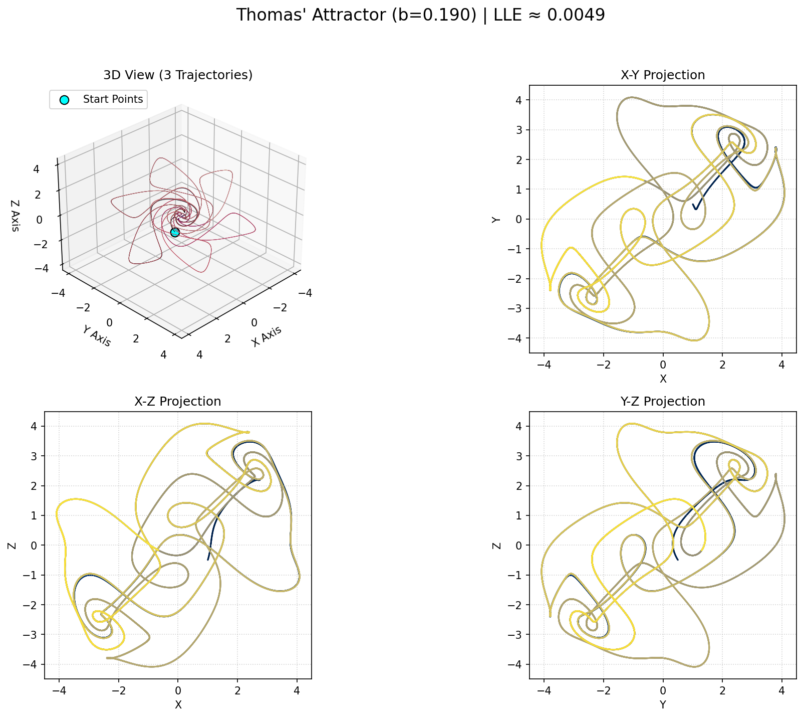

# Exploring Thomas' Attractor: Cyclic Symmetry and Chaos

<a href="thomas_output/thomas_interactive.html" title="Click to view Interactive Thomas' Attractor Plot">
  
</a>

> (Click the image above to explore the interactive 3D version if available)*

## 1. Introduction: A Dance of Sines

Welcome to the simulation of **Thomas' attractor**, a fascinating example of chaos arising from a remarkably simple set of equations exhibiting cyclic symmetry. Introduced by René Thomas, this system stands out due to its use of sine functions for non-linearity and its single control parameter.

Unlike systems directly derived from physical models like Lorenz's, Thomas' attractor is often presented as an abstract mathematical system demonstrating how elegant symmetry can coexist with complex, unpredictable dynamics. Visually, it generates intricate, looping, and often densely filled structures in 3D space, quite distinct from the Lorenz or Rössler attractors.

This repository contains a Python script `thomas_simulator.py` that allows you to compute, analyze, and visualize the behavior generated by these symmetric equations.

## 2. The Mathematics: Cyclic Symmetry in Action

Thomas' attractor is defined by three coupled ordinary differential equations (ODEs) where the variables $ x, y, z $ interact through sine functions and linear damping:

$$
\begin{aligned}
\frac{dx}{dt} &= \sin(y) - b x \\
\frac{dy}{dt} &= \sin(z) - b y \\
\frac{dz}{dt} &= \sin(x) - b z
\end{aligned}
$$

Where:

* $ x, y, z $ are the state variables defining a point in 3D phase space.
* $ t $ represents time.
* $ b $ is the single positive control parameter for the system.

**Key Features of the Equations:**

* **Cyclic Symmetry:** Notice how the equations cycle through the variables: the change in $ x $ depends on $ y $, the change in $ y $ depends on $ z $, and the change in $ z $ depends back on $ x $. This symmetry ($ x \to y \to z \to x $) influences the attractor's overall form.
* **Sine Function Non-linearity:** The non-linearity required for chaos comes from the bounded, oscillating nature of the $ \sin() $ function.
* **Linear Damping:** The $ -bx $, $ -by $, and $ -bz $ terms act as simple damping or friction, pulling the state towards the origin. The strength of this damping, controlled by $ b $, is crucial for the system's behavior.

**Parameter Value for Chaos:**

Chaos is typically observed for small positive values of $ b $. A commonly cited value is:
* $ b = 0.19 $ (or values nearby, e.g., $ b = 0.20 $)

Small changes in $ b $ can shift the system between chaotic and periodic regimes. If $ b $ is too large, the damping dominates, and the system settles to a stable fixed point at the origin.

## 3. Symmetric Equations, Asymmetric Dynamics

Despite the perfect symmetry in the equations, the resulting chaotic attractor exhibits complex, non-symmetric dynamics locally, while often retaining a sense of global, rotation-like symmetry.

* **Sensitivity to Initial Conditions:** Like all chaotic systems, tiny variations in the starting point $ (x_0, y_0, z_0) $ lead to exponentially diverging trajectories over time within the attractor.
* **Dense, Looping Structure:** The attractor often appears as a dense collection of interwoven loops and paths confined to a roughly spherical region. Visualizing it often requires longer simulation times compared to Lorenz or Rössler to see the structure fill in.
* **Positive Lyapunov Exponent:** A positive Largest Lyapunov Exponent (LLE) confirms the presence of chaos, indicating the average rate of separation of nearby trajectories.

## 4. Script Features & Functionality

This Python script provides the means to explore Thomas' attractor:

1.  **ODE Integration:** Solves the system using `scipy.integrate.odeint`.
2.  **LLE Calculation:** Estimates the LLE for the given parameter $ b $.
3.  **Static Plot Generation:** Creates a Matplotlib PNG image showing:
    * The 3D structure of the attractor, colored by time.
    * Standard 2D projections (X-Y, X-Z, Y-Z).
4.  **Animation Video:** Generates an MP4 video (requires **FFmpeg**) animating the trajectory as it weaves through the attractor space.
5.  **Interactive HTML Plot:** Creates a Plotly-based interactive 3D plot in an HTML file for detailed manual exploration in a web browser.
6.  **Cross-Platform File Opening:** Attempts to automatically launch the generated HTML file.

## 5. How to Use the Script

**Dependencies:**

* Python 3.x
* NumPy (`pip install numpy`)
* SciPy (`pip install scipy`)
* Matplotlib (`pip install matplotlib`)
* Plotly (`pip install plotly`)
* **FFmpeg:** (Required for MP4 animation) - Install via system package manager.

**Running the Script:**

1.  Save the script (e.g., `thomas_simulator.py`).
2.  Navigate to its directory in your terminal.
3.  Execute:
    ```bash
    python thomas_simulator.py
    ```

**Outputs:**

Results are saved in the `thomas_output` directory:

* `thomas_lle_results.txt`: Parameter $ b $, LLE estimate, and interpretation.
* `thomas_static_plots.png`: Static 3D and 2D plots.
* `thomas_animation.mp4`: Simulation video.
* `thomas_interactive.html`: Interactive 3D plot (will attempt to auto-open).

## 6. Configuration & Customization

Fine-tune the simulation via the constants defined near the script's beginning:

* **Output Files:** Change `OUTPUT_DIR_NAME`, etc.
* **Thomas Parameter:**
    * `THOMAS_PARAM_B`: Modify the value of the crucial parameter $ b $. Try values slightly above and below $ 0.19 $ (e.g., $ 0.1, 0.15, 0.20, 0.21, 0.3 $). Can you find periodic windows or the collapse to the origin?
* **Initial Conditions:**
    * `INITIAL_STATES`: Change the starting point $ [x_0, y_0, z_0] $. Thomas' attractor often has a large basin of attraction, meaning many different starting points will converge to it.
* **Time & Steps:**
    * `VIS_T_END`, `VIS_NUM_STEPS`, `LLE_T_END`, `LLE_NUM_STEPS`: Control duration and detail. **Note:** Thomas' attractor often benefits from significantly longer integration times (`T_END`) and more steps (`NUM_STEPS`) compared to Lorenz or Rössler to fully reveal its dense structure. Don't hesitate to increase these values substantially if your computer can handle it.
* **LLE Settings:** `LLE_EPSILON`.
* **Animation Settings:** `ANIMATION_WRITER`, `FPS`, `DPI`, `FRAME_STEP`, `TAIL_LENGTH`, `INTERVAL`. You might need to adjust `FRAME_STEP` and `TAIL_LENGTH` significantly based on the simulation duration.
* **Plotting:** `STATIC_PLOT_DPI`.

## 7. Understanding the Outputs

* **LLE Results (`.txt`):** A positive LLE indicates chaos for the chosen $ b $. Check how it changes as $ b $ varies.
* **Static Plots (`.png`):** Observe the intricate, looping structure. The 2D projections can look quite dense and "noisy" due to the overlapping paths.
* **Animation (`.mp4`):** Follow the trajectory as it winds through the complex pathways defined by the sine functions and damping.
* **Interactive Plot (`.html`):** Use this to zoom in and appreciate the fine structure and how the paths weave without intersecting. The symmetry might be more apparent from certain viewing angles.

## 8. Further Exploration

* **Parameter Scan:** Systematically vary $ b $ across a range (e.g., $ 0.1 $ to $ 0.3 $) and compute the LLE or generate plots for each value to map out the different dynamic regimes.
* **Very Long Simulations:** Increase `VIS_T_END` and `VIS_NUM_STEPS` significantly (e.g., T=1000 or more, with millions of steps) to see just how densely the attractor fills space.
* **Symmetry Breaking:** Could slight modifications to the equations (e.g., different coefficients for the damping terms or slight phase shifts in the sines) break the symmetry and lead to different attractors?

---
